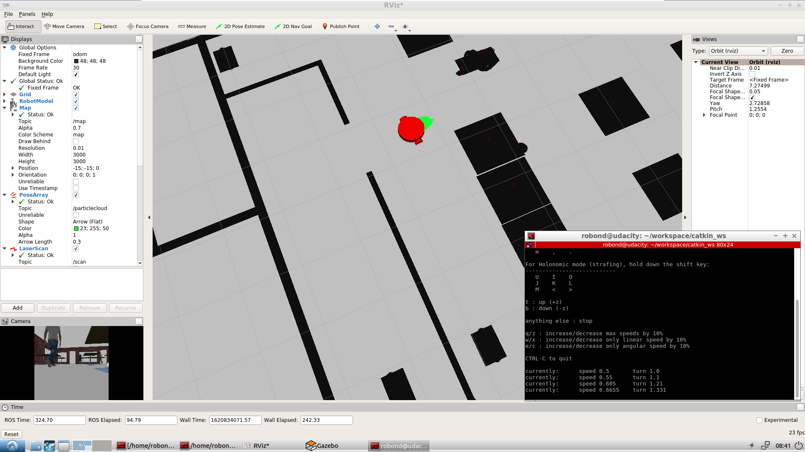
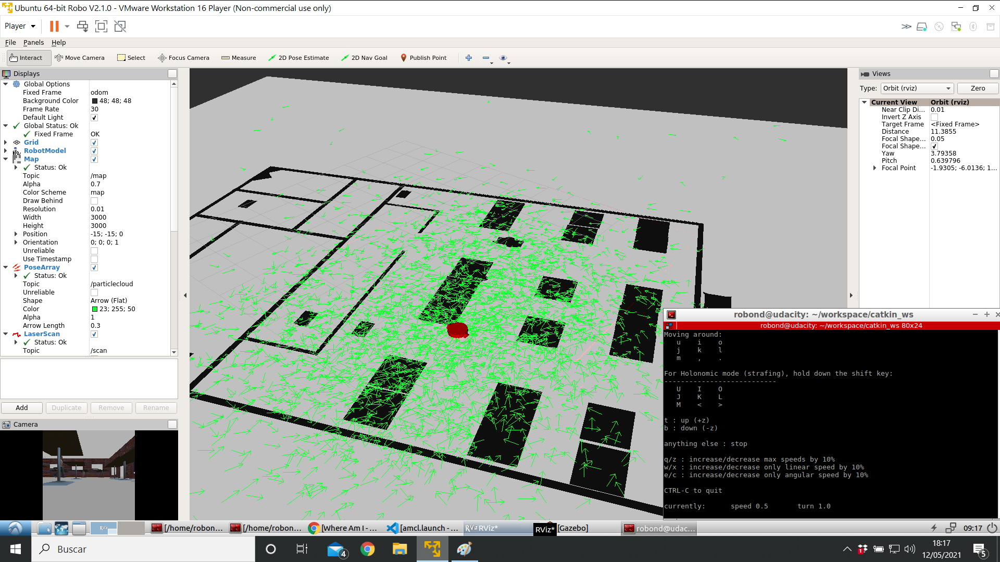
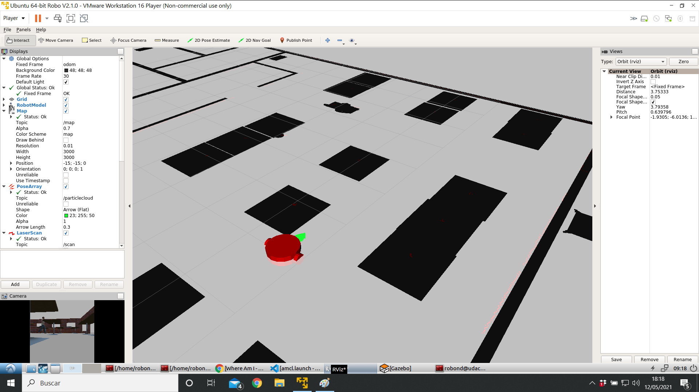

# RoboticsND-Where-Am-I

## Introduction
Thrid project in wich the objective is to implement Monte Carlo Localization (MCL) algorithm to estimate the robot position. 

### Working area
For this project my_world is the same as the previous one used in RoboticsND-Go-Chase-It project.

### Robot
Same as RoboticsND-Go-Chase-It project.

## File structure

## Results
Once 

After a few movements made with teleop the robot knows it position so it's time to increase difficulty.

Now the robot is taken to a different location of the map to test the performance of the localization algorithm.

With a few movements the robot locates its position so we can conclude that AMCL algorithm is well tuned and behaves properly.

## Troubleshootings

### Wrong initial position of the robot.
The robot initial pose is correct but is turned 90 degrees, so a correction is made in amcl.launch file.

    <param name="initial_pose_a" value="4.71"/>
    
### Bad performance after teletransportation
Some changes are made to improve robot localization after teletransportation.

    <param name="min_particles" value="1000"/>
    <param name="max_particles" value="5000"/>
    <param name="update_min_d" value="0.01"/>
    <param name="update_min_a" value="0.01"/>
